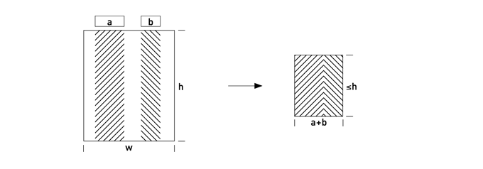
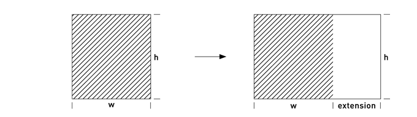
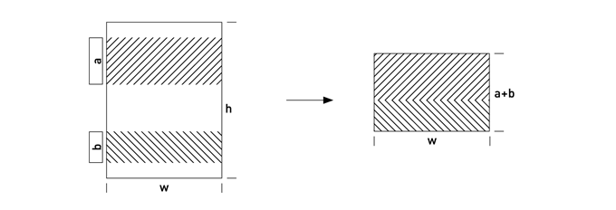
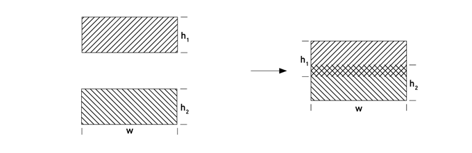
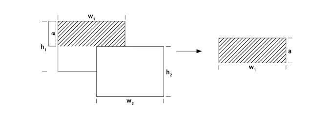
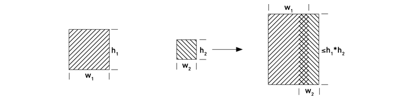
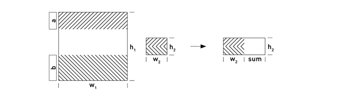

Table of contents:

* [Language Specification](#language_specification)
  * [Keywords](#keywords)
  * [Program Structure](#program_structure)
  * [Primitive Types](#primitive_types)
  * [Identifiers](#identifiers)
  * [Relational Types](#relational_types)
  * [Functions](#functions)
  * [Relational Operators and Expressions](#relational_operators_and_expressions)
* [Transactions](#transactions)
* [API](#api)

# Language Specification
## Keywords

Here are the keywords which are currently in use:

<table>
    <tr>
        <td>extend</td>
        <td>fn</td>
        <td>int</td>
        <td>join</td>
        <td>long</td>
        <td>minus</td>
    </tr>
    <tr>
        <td>project</td>
        <td>real</td>
        <td>rename</td>
        <td>return</td>
        <td>select</td>
        <td>string</td>
    </tr>
    <tr>
        <td>summary</td>
        <td>time</td>
        <td>type</td>
        <td>union</td>
        <td>var</td>
        <td>void</td>
    </tr>
</table>

The _time_ keyword has no meaning at the moment and is reserved for
the future release.

## Program Structure

A program is defined in a single source file. The file is evaluated from top
to bottom in one pass (similar to the C language).  The top-level elements
of the program can be of the following types:
* relational type declarations
* relational variable declarations
* function declarations

The convention for Bandicoot source file extension is `.b`.

## Primitive Types

Primitive types are scalar types and are used for attributes within relations,
as well as input parameters for functions. There are four types available:

<table>
    <thead>
        <th>Type</th>
        <th>Size</th>
        <th>Description</th>
    </thead>
    <tr>
        <td>int</td>
        <td>32-bit</td>
        <td>signed integer</td>
    </tr>
    <tr>
        <td>long</td>
        <td>64-bit</td>
        <td>signed integer</td>
    </tr>
    <tr>
        <td>real</td>
        <td>64-bit</td>
        <td>IEEE 754 double precision</td>
    </tr>
    <tr>
        <td>string</td>
        <td>0-1024 bytes</td>
        <td>UTF-8 encoded string</td>
    </tr>
</table>

The primitive types are referenced within this specification as _PrimitiveType_.

Bandicoot is a strongly-typed language and converting a primitive expression of
a given type into another type must be explicit. The current version of
Bandicoot supports only conversion from one numeric type to another. There
is no support for conversion between strings and numbers. The following syntax
forms are supported:

<pre>
    (int  <i>PrimitiveExpr</i>)
    (real <i>PrimitiveExpr</i>)
    (long <i>PrimitiveExpr</i>)
</pre>

## Identifiers

Here is the regular expression defining an identifier: `[_a-zA-Z0-9]+`. Maximum
identifier length is 32 characters. Below you will find the following
references to the identifiers:
* _TypeName_
* _AttrName_
* _VarName_
* _ParamName_
* _FuncName_

## Relational Types

There are two ways to declare a relational type: named and inline. Named
declarations give an identifier to some particular type so that it can be
referenced in the code later. Inline (or anonymous) declarations are useful
when the type is used only once (e.g. as an input or output function
parameter).

Named type can be declared in the following way:

<pre>
type <i>TypeName</i>
{
    <i>AttrName PrimitiveType</i> [,]
    [more attributes]
}
</pre>

and inline type:

<pre>
{
    <i>AttrName PrimitiveType</i> [,]
    [more attributes]
}
</pre>

The relational types (both inline and named) are referenced within this
specification as _RelType_.

## Relational Variables

Relational variables are used for keeping the program state. The system
provides two types of variables:
* global variables
* local (temporary) variables

Here is how you can declare a global variable named _VarName_.

<pre>
var <i>VarName RelType</i> ;
</pre>
 
The relational variables are referenced within this specification as _RelVar_.

## Functions

Functions are identified by names which must be unique across the whole
program source file. A function can make complex state transformations on top
of the global variables (see <a href="#transactions">Transactions</a> section).

<pre>
fn <i>FuncName</i> ( <i>FuncArgs</i> ) <i>FuncReturn</i>
{
    <i>FuncBody</i>
}
</pre>

_FuncArgs_ can be contain only one relational argument and and several
arguments of a primitive type all separated with the commas. Each argument has
the following structure:

<pre>
<i>ArgName</i> &quot;<i>RelType</i> | <i>PrimitiveType</i>&quot;
</pre>

The _FuncReturn_ defines the result type of a function. It can either be a
relational type or no result at all, identified by keyword _void_:

<pre>
<i>RelType</i> | <i>void</i>
</pre>

Function body (_FuncBody_) is a list of statements evaluated from top to
bottom. The list is separated with the semicolons (&quot;;&quot;). Statements
can be of three types:

* global variable assignment
<pre>
<i>VarName</i> = <i>RelExpr</i> ;
</pre>
* temporary variable declaration and assignment
<pre>
var <i>VarName</i> = <i>RelExpr</i> ;
</pre>
* return statement (only if a function declares its output type)
<pre>
return <i>RelExpr</i> ;
</pre>

A function cannot call another function. Also, only one assignment per
global relational variable is possible within a function body. After the
assignment the global variable cannot be accessed anymore (within the same
function). This is a temporary limitation and you can workaround it with
the help of temporary variables.

## Relational Operators and Expressions

Bandicoot implements 8 [relational operators](bandicoot-algebra.pdf) which
provide rich data manipulative features. Some of the operators are _binary_
(take 2 relations as input) and some are _unary_ (take 1 relation as input).
Apart from the relational inputs these operators usually take additional
argument specific to the operator. Every operator returns a new relation and
does not modify the inputs. The language provides these operators as functions
with arguments:

<pre>
<i>OperatorName</i> (<i>arg1</i>) (<i>arg2</i>) ... (<i>argN</i>)
</pre>

The brackets around the arguments are mandatory only if the argument is an
operator with at least one argument.

Every relational variable (global or local) is an operator as well and returns
the value of the variable. The operators are the main building blocks in the
language. Complex relational expressions (_RelExpr_) can be created by nesting
the relational operators to compute the desired results.

### Rename

<pre>
rename <i>ToAttrName</i> = <i>FromAttrName</i> [,] [more attributes] <i>RelExpr</i> 
</pre>

This operator creates a new relation with the specified attributes being
renames, the relational body (tuples) does not change.

### Project

<pre>
project <i>AttrName</i> [,] [more attributes] <i>RelExpr</i>
</pre>

The result contains only the attributes defined as the first argument. It can
have reduced number of tuples due to removal of duplicate values.

### Extend

<pre>
extend <i>AttrName</i> = <i>PrimitiveExpr</i> [,] [more attributes] <i>RelExpr</i>
</pre>

The operator adds the attributes defined as the first argument to each tuple
of the input relation. The values are computed by primitive expressions.

### Select

<pre>
select <i>BooleanExpr</i> <i>RelExpr</i> 
</pre>

The result contains only those tuples of the input relation which match the
boolean expression defined as the first argument.

### Union

<pre>
union <i>RelExpr</i> <i>RelExpr</i>
</pre>

or

<pre>
<i>RelExpr</i> + <i>RelExpr</i>
</pre>

The union operator creates a new relation consisting of two input relations
removing duplicate tuples. Both inputs need to have the same attributes.

### Minus (Semidifference)

<pre>
minus <i>RelExpr</i> <i>RelExpr</i>
</pre>

or

<pre>
<i>RelExpr</i> - <i>RelExpr</i>
</pre>

Removes tuples from the first input which match tuples in the second input.
The matching logic is an equality on the common attributes.

### Natural Join

<pre>
join <i>RelExpr</i> <i>RelExpr</i>
</pre>

or

<pre>
<i>RelExpr</i> * <i>RelExpr</i>
</pre>

This operator creates a result where the tuples are combinations of matching
tuples from both input relations. The matching logic is an equality on the
common attributes. If there are no common attributes the result is a cartesian
join (i.e. every tuple from the first input matches every tuple in the second
input). All the attributes from the input relations are present in the result.

### Summary

#### Unary version
<pre>
summary <i>AttrName</i> = <i>SumFunc</i> [,] [more attributes] <i>RelExpr</i>
</pre>

#### Binary version

<pre>
summary <i>AttrName</i> = <i>SumFunc</i> [,] [more attributes] <i>RelExpr</i> <i>RelExpr</i>
</pre>

Both unary and binary versions of summary operator produce tuples containing
summary data grouped according to the specified attributes. In case of the
unary version, the grouping is done by a virtual relation with zero attributes
and therefore the result contains up to one tuple. The binary version creates
the groups according to all the attributes of the second relation.

Result type is expressed as an extension of the empty relation (unary summary)
or rightmost relation (binary summary). Each attribute can be of a specified
summary function (_SumFunc_). Here is a list of currently supported functions:

* add - sum up the values of an attribute
<pre>
(add <i>AttrName</i> <i>DefVal</i>)
</pre>
* avg - average of values of an attribute
<pre>
(avg <i>AttrName</i> <i>DefVal</i>)
</pre>
* cnt - count the number of tuples
<pre>
(cnt)
</pre>
* max - maximum value of an attribute
<pre>
(max <i>AttrName</i> <i>DefVal</i>)
</pre>
* min - minimum value of an attribute
<pre>
(min <i>AttrName</i> <i>DefVal</i>)
</pre>

Where _DefVal_ is a constant expression. The type of the expression should
match the type of the result and attribute. The exception is the _avg_
function where the default value and result are always real numbers. _DefVal_
is used in those cases when the _RelExpr_ body is empty. In case of the binary
summary this can happen when there is no matching tuple in left _RelExpr_ for
a tuple in the right _RelExpr_.

# Transactions

Each invocation of a function implicitly creates a transaction. All the
statements within a function are part of the same transaction.  There are no
explicit keywords to commit or rollback a transaction. If there is an error
the rollback is performed automatically and an error code is returned to the
client.

Modification of a global variable is not allowed by two transactions at the
same time. Therefore two functions which modify the same variable are
serialized and executed one after the other. Read-only functions are executed
in parallel with other read/write functions.

The level of isolation is always serializable and it means that if a read of
the same variable occurs several times within a function it always returns
the same data even if the variable is modified by a different function at
the same time.

# API

Bandicoot API is based on the HTTP/1.1 protocol. The interface exposes all the
functions defined in a program source file through
`http://server:port/FuncName` URLs. The HTTP POST method must be used to invoke
a function with an input parameter. Otherwise the HTTP GET is required.

Both input and output parameters are exchanged in &quot;comma separated
values&quot; format. The tuples are delimited with the `\n` end-of-line
character. The first line is a relational head definition in the following
format:

<pre>
    <i>AttrName PrimitiveType</i> [,][more attributes]
</pre>

The comma or the end-of-line character can be escaped by using `\` character.
It means the Bandicoot will not represent those characters and they will be
treated as part of your data.
